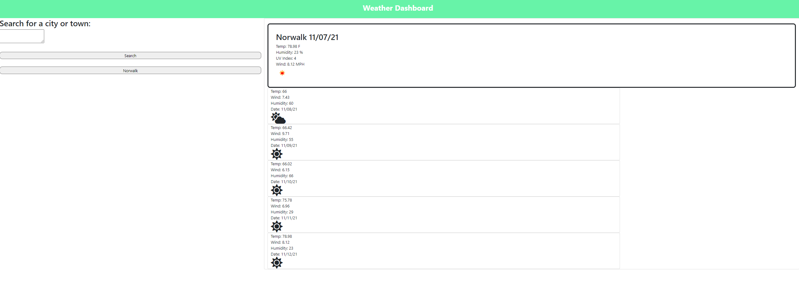

# WeatherDashboard-Week6

<a href="https://brandonconte.github.io/WeatherDashboard-Week6/">Weather Dashboard Link</a>

## The Repository

This repository is where I create a Weather Dashboard using the Open Weather Map API

## Weather Dashboard

When you click the live link above, you will be able to enter a town or city that you would like to get the weather of.
The top box will show the weather for tomorrow, and below that will show a 5 day forecast of the desired area. Includes Temperature, Humidity, Wind speed, and UV Index.